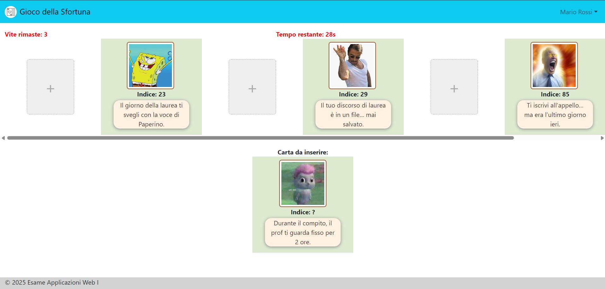
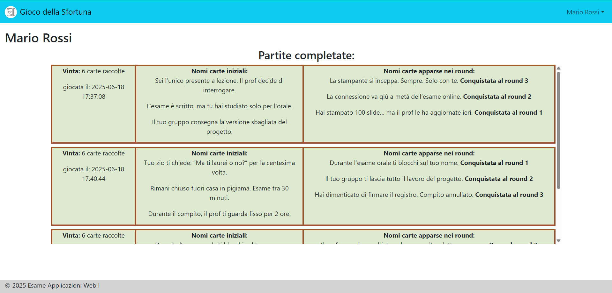

## "Gioco della Sfortuna"

## How to run

### Prerequisiti

- Node.js e npm installati.
- Un terminale per il server e un secondo terminale per il client.

### Installazione

Dalla cartella principale del progetto, installare le dipendenze di entrambe le applicazioni:

```bash
cd server
npm install

cd ../client
npm install
```

### Avvio

Avviare il server in un primo terminale:

```bash
cd server
node index.mjs
```

Il server sarà disponibile all'indirizzo `http://localhost:3001`.

In un secondo terminale, avviare il client:

```bash
cd client
npm run dev
```

Aprire quindi `http://localhost:5173` nel browser. Il database SQLite viene gestito automaticamente dal server.

## React Client Application Routes

- Route `/`: 
  - **page content**: Pagina home, contiene la descrizione del gioco ed i bottoni per accedere oppure iniziare una partita come utente anonimo (visitatore).
  - **purpose**: Far conoscere ai nuovi giocatori le regole del gioco e permettere l'inizio di una partita dopo aver fatto l'accesso oppure senza aver fatto l'accesso.
- Route `/login`: 
  - **page content**: Form di inserimento di email e password per gli utenti pre-registrati + bottoni per effettuare l'accesso o tornare alla homepage (indietro).
  - **purpose**: Permettere agli utenti pre-registrati di effettuare l'accesso. Dopo aver effettuato l'accesso l'utente viene automaticamente reindirizzato alla homepage.
- Route `/partita`:
  - **page content**: Pagina dove si svolge la partita, contiene le carte iniziali già possedute dal giocatore (ad inizio partita 3 carte) di cui vede tutte le informazioni. Una carta "misteriosa" di cui non vede l'indice di sfortuna. Tempo restante al giocatore per effettuare la scelta. Contatore delle vite rimaste (possibilità di sbagliare).
  - **purpose**: Far avanzare il giocatore durante la partita. Viene utilizzato il meccanismo di drag and drop per permettere al giocatore di aggiungere ad ogni round la carta misteriosa al suo mazzo di carte.
- Route `/paginaProfilo`:
  - **page content**: Pagina profilo del giocatore, contiene il nome e cognome del giocatore + tutta la cronologia delle sue partite giocate, ordinate per data crescente.
  - **purpose**: Far vedere al giocatore il nome ed il cognome con cui si registrato e la sua storia mediante un riepilogo dettagliato di tutte le sue partite completate.
- Route `/partita/riepilogo`:
  - **page content**: Tutte le carte conquistate dal giocatore durante la partita + 2 bottoni per iniziare una nuova partita o per tornare alla homepage.
  - **purpose**: Far vedere al giocatore un riepilogo di com'è andata la sua partita, mostrandogli tutte le informazioni delle carte (per l'ultima volta) che ha coinquistato durante la partita appena conclusa.

## API Server

- POST `/api/sessions`
  - **request parameters and request body content**: `email` e `password` dell'utente in formato json.
  - **response body content**: oggetto utente in caso di successo, errore 401 in caso di credenziali errate.
- GET `/api/sessions/current`
  - **request parameters**: non ci sono parametri
  - **response body content**: oggetto json che rappresenta l'utente, se questo è autenticato, altrimenti oggetto json contenente l'errore 401.
- DELETE `/api/sessions/current`
  - **request parameters**: non ci sono parametri
  - **response body content**: null se tutto è andato a buon fine, errore 500 altrimenti.
- GET `/api/partita/deckCards`
  - **request parameters**: non ci sono parametri
  - **response body content**: array contenente 3 oggetti, ognuno per rappresentare una delle 3 carte del mazzo date al giocatore ad inizio partita, tutto in formato json. Errore 500 altrimenti.
- POST `/api/partita/unknownIndexCards`
  - **request parameters and request body content**: oggetto contenente un array con 3 identificativi delle carte del mazzo e il numero delle carte misteriose da prelevare dal database (1 o 5).
  - **response body content**: oggetto json contenente un array con 1 o 5 carte misteriose, errore 500 altrimenti.
- POST `/api/partita/unknownCardIndex`
  - **request parameters and request body content**: identificativo della carta misteriosa di cui si deve prendere l'indice di sfortuna
  - **response body content**: oggetto json contenente l'indice di sfortuna della carta misteriosa, errore 500 altrimenti.
- POST `/api/partita/addMatch` (richiede l'autenticazione)
  - **request parameters and request body content**: oggetto contenente l'oggetto match con dentro tutti i dettagli della partita appena conclusa da salvare nel database
  - **response body content**: null se tutto va a buon fine, errore 500 altrimenti.
- GET `/api/paginaProfilo/:idUtente` (richiede l'autenticazione)
  - **request parameters**: identificativo dell'utente di cui si vuole prelevare la cronologia delle sue partite salvate nel database.
  - **response body content**: oggetto json contenente un array di oggetti partita con dentro tutti i dettagli di ogni partita. Errore 500 altrimenti.

## Database Tables

- Tabella `CARTA` - contiene le carte, ciascuna con un `nome`, un'`immagine` ed un `indice` univoco.
- Tabella `PARTITA` - memorizza le partite giocate dagli utenti, contiene l'`identificativo dell'utente` che ha giocato quella partita, la `data` di quando è stata giocata la partita, il `numero di carte raccolte` e l'`esito`.
- Tabella `ROUND` - rappresenta i singoli round all'interno di una partita, collegando le carte alle partite e indicando se la carta è stata `conquistata` e a che round `nRound`. Le 3 carte iniziali già presenti nel mazzo del giocatore sono memorizzate in questa tabella con `nRound` e `conquistata` uguali a `null`
- Tabella `UTENTE` - contiene le informazioni degli utenti, `idUtente`, `nome`, `cognome`, `email`, `password` e `salt` utilizzato per la crittografia.

## Main React Components

- `DefaultLayout` (in `DefaultLayout.js`): 
  - **component purpose**: aumentare la modularità dell'applicazione.
  - **main functionality**: dichiarare i componenti che costituiscono il layout di base che si va a ripetere nelle diverse routes.
- `HomePage` (in `HomePage.js`): 
  - **component purpose**: introdurre il giocatore all'applicazione.
  - **main functionality**: rendere le regole del gioco note al giocatore ed introdurlo alla partita da loggato oppure come visitatore mediante dei bottoni.
- `LoggedMatch` (in `LoggedMatch.js`): 
  - **component purpose**: permettere agli utenti loggati di giocare partite costituite da più round.
  - **main functionality**: contiene la logica principale del gioco per gli utenti loggati, principalemente gestita con gli stati ed hook. Contiene anche l'implementazione del timer, insieme ai moduli per l'implementazione del drag and drop. La gestione dei round e della partita.
- `NotLoggedMatch` (in `NotLoggedMatch.js`): 
  - **component purpose**: permettere agli utenti non loggati (visitatori del sito) di giocare partite costituite da più round.
  - **main functionality**: contiene la logica principale del gioco per gli utenti non loggati, principalemente gestita con gli stati ed hook. Contiene anche l'implementazione del timer, insieme ai moduli per l'implementazione del drag and drop.
- `LoginForm` (in `LoginForm.js`): 
  - **component purpose**: permettere agli utenti registrati di autenticarsi.
  - **main functionality**: il form utilizza lo stato per gestire l'invio delle credenziali (email e password), mostra messaggi di errore in caso di autenticazione fallita e segnala all'utente quando la richiesta è in corso. Dopo il login, richiama la funzione di gestione del login fornita dal componente genitore.
- `MatchSummary` (in `MatchSummary.js`): 
  - **component purpose**: permettere agli utenti autenticati e non di vedere un riepilogo della partita appena conclusa, mostrando tutte le informazioni sulle carte conquistate.
  - **main functionality**: il componente riceve tramite props il mazzo di carte conquistate (`deckCards`) e lo visualizza in modo orizzontale, mostrando per ciascuna carta l’immagine, il nome e l’indice di sfortuna tramite il componente `StuffCard`. Permette inoltre di iniziare una nuova partita tramite il pulsante "Nuova Partita", che azzera i round e reindirizza l’utente alla pagina della partita, oppure di tornare alla homepage tramite il pulsante "Fine".
- `NavHeader` (in `NavHeader.js`): 
  - **component purpose**: permettere agli utenti autenticati e non di navigare tra le principali sezioni dell'applicazione tramite una barra di navigazione.
  - **main functionality**: visualizza una navbar con il logo e il titolo del gioco. Se l’utente è autenticato, mostra un menu dropdown con il suo username, il bottone alla homepage, alla pagina profilo ed un bottone per il logout. Se l’utente non è autenticato, invece, mostra solo il bottone alla homepage.
- `UserPage` (in `UserPage.js`): 
  - **component purpose**: solo per gli utenti autenticati, mostrare il profilo dell'utente con la cronologia delle sue partite giocate in dettaglio.
  - **main functionality**: recupera, tramite API, la lista ordinata delle partite giocate dall’utente. Per ogni partita mostra l’esito (vinta/persa), il numero di carte raccolte, la data, i nomi delle carte iniziali e i dettagli delle carte apparse nei round, specificando se sono state conquistate o perse e in quale round.
- `StuffCard` (in `StuffCard.js`): 
  - **component purpose**: visualizzare una singola carta del gioco.
  - **main functionality**: riceve tramite props l’immagine, il nome e l’indice di sfortuna della carta e li mostra. Se l’indice è quello della carta "misteriosa" visualizza un punto interrogativo.
- `AfterEachRoundModal` (in `AfterEachRoundModal.js`): 
  - **component purpose**: per gli utenti autenticati e non, mostra un messaggio di feedback alla fine di ogni round della partita.
  - **main functionality**: visualizza un modal che comunica all’utente l’esito del round (indovinato, non indovinato, vittoria, sconfitta o tempo scaduto). Permette di passare al round successivo o di terminare la partita (nel caso in cui fosse l'ultimo round) tramite i pulsanti, gestendo la navigazione verso la pagina appropriata. Non è possibile chiuderlo se non mediante i pulsanti.

## Screenshot

Pagina partita:



Pagina profilo utente:



## Users Credentials

- username: `mario.rossi@email.it`, password: `password`
- username: `mario.bianchi@email.it`, password: `password`
